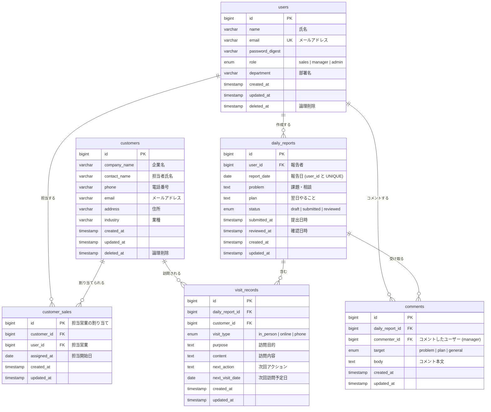

# 営業日報システム — 要件定義 & ER図

---

## 1. システム概要

営業担当者が日々の顧客訪問記録・課題・翌日計画を報告し、上長がフィードバックを行う営業日報管理システム。

---

## 2. 利用者ロール

| ロール | 説明 |
|--------|------|
| `sales` | 営業担当者。日報の作成・編集を行う |
| `manager` | 上長。日報の閲覧・コメントを行う |
| `admin` | システム管理者。マスタ管理を行う |

---

## 3. 機能要件

### 3-1. マスタ管理
- **顧客マスタ**：顧客企業の基本情報（企業名・担当者・連絡先・業種・住所）を管理する
- **ユーザーマスタ（営業マスタ）**：社員の基本情報とロールを管理する

### 3-2. 日報（DailyReport）
- 営業担当者は 1日 1件の日報を作成できる（同一ユーザー・同一日付でユニーク）
- ステータスは `draft`（下書き）→ `submitted`（提出）→ `reviewed`（確認済み）の順に遷移する
- 提出後は営業担当者自身は内容を編集できない（上長は閲覧・コメントのみ）

### 3-3. 訪問記録（VisitRecord）
- 1件の日報に対して複数の訪問記録を追加できる
- 訪問した顧客（顧客マスタから選択）、訪問種別（対面 / オンライン / 電話）、訪問目的・内容・次回アクションを記録する

### 3-4. 課題・相談（Problem）と翌日計画（Plan）
- 日報に紐づく自由記述フィールドとして `problem`（課題・相談）と `plan`（翌日やること）を持つ
- 上長はそれぞれのフィールドに対してコメントを残せる
- コメントはどのフィールドへの発言かを `target`（`problem` / `plan` / `general`）で区別する

---

## 4. 非機能要件（設計上の前提）

- 論理削除（`deleted_at`）を採用し、マスタデータは物理削除しない
- 全テーブルに `created_at` / `updated_at` を設ける
- 顧客マスタと担当営業は M:N（多対多）の関係を許容する（`customer_sales` 中間テーブル）

---

## 5. ER図

---

## 6. テーブル間の主なリレーション整理

| 関係 | カーディナリティ | 説明 |
|------|----------------|------|
| users → daily_reports | 1 : N | 1人の営業が複数の日報を持つ |
| daily_reports → visit_records | 1 : N | 1件の日報に複数の訪問記録 |
| customers → visit_records | 1 : N | 1顧客が複数の訪問記録に登場 |
| daily_reports → comments | 1 : N | 1件の日報に複数のコメント |
| users → comments | 1 : N | 1人の上長が複数のコメントを投稿 |
| customers ↔ users | M : N | 顧客マスタと担当営業は中間テーブル `customer_sales` で管理 |

---

## 7. 主要な制約・インデックス方針

| テーブル | 制約 / インデックス |
|----------|-------------------|
| `users` | `email` UNIQUE |
| `daily_reports` | `(user_id, report_date)` UNIQUE CONSTRAINT — 1日1日報を保証 |
| `daily_reports` | `status`, `report_date` にインデックス（一覧検索用） |
| `visit_records` | `daily_report_id`, `customer_id` にインデックス |
| `comments` | `daily_report_id` にインデックス |
| `customer_sales` | `(customer_id, user_id)` UNIQUE CONSTRAINT |
