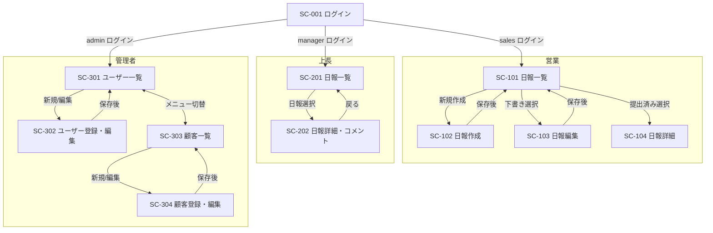

# 営業日報システム — 画面設計書

---

## 1. 画面一覧

| 画面ID | 画面名 | 概要 | 利用者 |
|--------|--------|------|--------|
| SC-001 | ログイン | メールアドレス・パスワードによる認証 | 全ロール |
| SC-101 | 日報一覧（営業） | 自分の日報をステータス・期間で絞り込み一覧表示 | sales |
| SC-102 | 日報作成 | 訪問記録・課題・翌日計画を入力して日報を作成 | sales |
| SC-103 | 日報編集 | 下書き状態の日報を編集 | sales |
| SC-104 | 日報詳細（営業） | 提出済み日報の読み取り専用表示・上長コメント確認 | sales |
| SC-201 | 日報一覧（上長） | 部下全員の日報を担当者・期間・ステータスで絞り込み一覧表示 | manager |
| SC-202 | 日報詳細・コメント（上長） | 日報の読み取り表示・課題/計画へのコメント投稿・確認済み処理 | manager |
| SC-301 | ユーザーマスタ一覧 | 社員情報の一覧・検索・論理削除 | admin |
| SC-302 | ユーザーマスタ登録・編集 | 社員情報の新規登録および編集 | admin |
| SC-303 | 顧客マスタ一覧 | 顧客情報の一覧・検索・論理削除 | admin |
| SC-304 | 顧客マスタ登録・編集 | 顧客情報と担当営業の新規登録および編集 | admin |

---

## 2. 画面遷移図



---

## 3. 画面詳細

---

### SC-001 ログイン

#### 概要
システムへの入口となる認証画面。ロールに応じてログイン後の遷移先が変わる。

#### 画面レイアウト

```
┌─────────────────────────────────────────┐
│           営業日報システム               │
├─────────────────────────────────────────┤
│                                         │
│  メールアドレス                          │
│  [ email@example.com           ]        │
│                                         │
│  パスワード                              │
│  [ ••••••••                    ]        │
│                                         │
│  [ ログイン ]                            │
│                                         │
└─────────────────────────────────────────┘
```

#### 画面項目

| 項目ID | 項目名 | 種別 | DB対応カラム | 必須 | 備考 |
|--------|--------|------|-------------|------|------|
| F001 | メールアドレス | テキスト入力 | users.email | ○ | |
| F002 | パスワード | パスワード入力 | users.password_digest | ○ | 入力値は画面上マスク表示 |
| B001 | ログインボタン | ボタン | — | — | |

#### バリデーション一覧

| 項目ID | 条件 | チェックタイミング |
|--------|------|--------------------|
| F001 | 必須 | 送信時 |
| F001 | メールアドレス形式 | 送信時 |
| F002 | 必須 | 送信時 |
| F002 | 8文字以上 | 送信時 |
| — | メールアドレスとパスワードの組み合わせが正しいこと | 送信時（サーバー） |
| — | アカウントが論理削除されていないこと（deleted_at IS NULL） | 送信時（サーバー） |

#### エラーメッセージ

| 項目ID | エラー条件 | メッセージ |
|--------|------------|-----------|
| F001 | 未入力 | メールアドレスを入力してください |
| F001 | メール形式不正 | 正しいメールアドレス形式で入力してください |
| F002 | 未入力 | パスワードを入力してください |
| F002 | 8文字未満 | パスワードは8文字以上で入力してください |
| — | 認証失敗（組み合わせ不一致 / 削除済み） | メールアドレスまたはパスワードが正しくありません |

---

### SC-101 日報一覧（営業）

#### 概要
ログイン中の営業担当者自身の日報をステータス・期間でフィルタリングして一覧表示する。

#### 画面レイアウト

```
┌────────────────────────────────────────────────────────────┐
│ 営業日報システム                    [山田 太郎] [ログアウト] │
├────────────────────────────────────────────────────────────┤
│ 日報一覧                            [ + 本日の日報を作成  ] │
├────────────────────────────────────────────────────────────┤
│ 期間: [ 2026/05/01 ] ～ [ 2026/06/02 ]                     │
│ ステータス: [すべて ▼]                        [ 検索 ]      │
├────────────────────────────────────────────────────────────┤
│ 報告日       ステータス   訪問件数   提出日時        操作    │
├────────────────────────────────────────────────────────────┤
│ 2026/06/02   下書き       1件        —              [編集]  │
│ 2026/06/01   確認済み     2件        06/01 18:30    [詳細]  │
│ 2026/05/31   提出済み     3件        05/31 19:00    [詳細]  │
└────────────────────────────────────────────────────────────┘
```

#### 画面項目

| 項目ID | 項目名 | 種別 | DB対応カラム | 備考 |
|--------|--------|------|-------------|------|
| F101 | 期間（開始） | 日付入力 | daily_reports.report_date | デフォルト: 当月1日 |
| F102 | 期間（終了） | 日付入力 | daily_reports.report_date | デフォルト: 本日 |
| F103 | ステータス | セレクト | daily_reports.status | すべて / 下書き / 提出済み / 確認済み |
| L001 | 報告日 | テキスト（リスト） | daily_reports.report_date | |
| L002 | ステータス | バッジ | daily_reports.status | 色分け表示 |
| L003 | 訪問件数 | テキスト | visit_records（COUNT） | |
| L004 | 提出日時 | テキスト | daily_reports.submitted_at | 未提出時は「—」 |
| B101 | 本日の日報を作成 | ボタン | — | 本日分が既に存在する場合は非表示 |
| B102 | 編集 | ボタン（行） | — | status = draft のみ表示 |
| B103 | 詳細 | ボタン（行） | — | status = submitted / reviewed に表示 |

#### バリデーション一覧

| 項目ID | 条件 | チェックタイミング |
|--------|------|--------------------|
| F101, F102 | 開始日 ≤ 終了日 | 検索時 |

#### エラーメッセージ

| 項目ID | エラー条件 | メッセージ |
|--------|------------|-----------|
| F101, F102 | 開始日 > 終了日 | 開始日は終了日以前を指定してください |
| — | 検索結果0件 | 該当する日報はありません |

---

### SC-102 日報作成

#### 概要
当日の日報を新規作成する。訪問記録を複数件追加でき、課題・翌日計画を記入する。「下書き保存」と「提出」の2つの保存アクションを持つ。

#### 画面レイアウト

```
┌────────────────────────────────────────────────────────────┐
│ 営業日報システム                    [山田 太郎] [ログアウト] │
├────────────────────────────────────────────────────────────┤
│ 日報作成                                                    │
│ 報告日: [ 2026/06/02 ]（自動入力・変更不可）                │
├────────────────────────────────────────────────────────────┤
│ ■ 訪問記録                                [ + 訪問を追加 ] │
│                                                             │
│  ▼ 訪問 #1                                        [ 削除 ] │
│  顧客名       [ 株式会社〇〇         ▼ ]                   │
│  訪問種別     ( 対面 ) ( オンライン ) ( 電話 )              │
│  訪問目的     [ ________________________________ ]          │
│  訪問内容     [ ________________________________ ]          │
│               [ ________________________________ ]          │
│  次回アクション[ ________________________________ ]         │
│  次回訪問予定日 [ 2026/06/10 ]                              │
│                                                             │
│  ▼ 訪問 #2                                        [ 削除 ] │
│  （同上の入力欄）                                           │
│                                                             │
├────────────────────────────────────────────────────────────┤
│ ■ 課題・相談                                                │
│  [ _______________________________________________________ ]│
│  [ _______________________________________________________ ]│
│                                                             │
│ ■ 明日やること                                              │
│  [ _______________________________________________________ ]│
│  [ _______________________________________________________ ]│
│                                                             │
├────────────────────────────────────────────────────────────┤
│              [ 下書き保存 ]  [ 提出する ]  [ キャンセル ]   │
└────────────────────────────────────────────────────────────┘
```

#### 画面項目

| 項目ID | 項目名 | 種別 | DB対応カラム | 必須 | 備考 |
|--------|--------|------|-------------|------|------|
| F201 | 報告日 | 日付（読み取り専用） | daily_reports.report_date | ○ | 本日日付を自動セット |
| F202 | 顧客名 | セレクト | visit_records.customer_id | ○ | customers マスタから選択（論理削除済みを除く） |
| F203 | 訪問種別 | ラジオボタン | visit_records.visit_type | ○ | 対面 / オンライン / 電話 |
| F204 | 訪問目的 | テキスト入力 | visit_records.purpose | ○ | |
| F205 | 訪問内容 | テキストエリア | visit_records.content | ○ | |
| F206 | 次回アクション | テキストエリア | visit_records.next_action | — | |
| F207 | 次回訪問予定日 | 日付入力 | visit_records.next_visit_date | — | |
| F208 | 課題・相談 | テキストエリア | daily_reports.problem | — | |
| F209 | 明日やること | テキストエリア | daily_reports.plan | — | |
| B201 | 訪問を追加 | ボタン | — | — | クリックで訪問記録欄を1件追加 |
| B202 | 削除（訪問記録行） | ボタン | — | — | 最後の1件は削除不可 |
| B203 | 下書き保存 | ボタン | daily_reports.status = draft | — | |
| B204 | 提出する | ボタン | daily_reports.status = submitted | — | |
| B205 | キャンセル | ボタン | — | — | SC-101 へ戻る |

#### バリデーション一覧

| 項目ID | 条件 | チェックタイミング |
|--------|------|--------------------|
| F202 | 必須（各訪問記録） | 提出時・下書き保存時 |
| F203 | 必須（各訪問記録） | 提出時・下書き保存時 |
| F204 | 必須（各訪問記録） | 提出時 |
| F204 | 200文字以内 | 入力中・提出時 |
| F205 | 必須（各訪問記録） | 提出時 |
| F205 | 1000文字以内 | 入力中・提出時 |
| F206 | 500文字以内 | 入力中・提出時 |
| F207 | 日付形式（YYYY/MM/DD） | 入力中 |
| F207 | 本日以降の日付 | 提出時 |
| F208 | 2000文字以内 | 入力中・提出時 |
| F209 | 2000文字以内 | 入力中・提出時 |
| — | 訪問記録が1件以上あること | 提出時 |
| — | 同一ユーザー・同一日付の日報が未存在であること | 保存時（サーバー） |

#### エラーメッセージ

| 項目ID | エラー条件 | メッセージ |
|--------|------------|-----------|
| F202 | 未選択 | 顧客を選択してください |
| F203 | 未選択 | 訪問種別を選択してください |
| F204 | 未入力（提出時） | 訪問目的を入力してください |
| F204 | 200文字超過 | 訪問目的は200文字以内で入力してください |
| F205 | 未入力（提出時） | 訪問内容を入力してください |
| F205 | 1000文字超過 | 訪問内容は1000文字以内で入力してください |
| F206 | 500文字超過 | 次回アクションは500文字以内で入力してください |
| F207 | 過去日 | 次回訪問予定日は本日以降を指定してください |
| F208 | 2000文字超過 | 課題・相談は2000文字以内で入力してください |
| F209 | 2000文字超過 | 明日やることは2000文字以内で入力してください |
| — | 訪問記録0件（提出時） | 訪問記録を1件以上追加してください |
| — | 重複日報（サーバー） | 本日の日報は既に存在します |

---

### SC-103 日報編集

#### 概要
ステータスが `draft`（下書き）の日報を編集する。レイアウト・項目・バリデーション・エラーメッセージは SC-102 と同一。以下の差分のみ記載する。

#### SC-102 との差分

| 項目 | SC-102（作成） | SC-103（編集） |
|------|---------------|---------------|
| 報告日 | 本日日付を自動セット | 既存の日報の日付を表示（変更不可） |
| 初期値 | 空 | 既存の保存内容を読み込み表示 |
| アクセス制御 | 当日分が未作成の場合に利用可能 | status = draft の場合のみ利用可能 |

---

### SC-104 日報詳細（営業）

#### 概要
提出済み（`submitted`）または確認済み（`reviewed`）の日報を読み取り専用で表示する。上長のコメントも表示する。

#### 画面レイアウト

```
┌────────────────────────────────────────────────────────────┐
│ 営業日報システム                    [山田 太郎] [ログアウト] │
├────────────────────────────────────────────────────────────┤
│ 日報詳細  2026/06/01（月）                  ステータス: 確認済み│
├────────────────────────────────────────────────────────────┤
│ ■ 訪問記録                                                  │
│                                                             │
│  【訪問 #1】                                                │
│  顧客：株式会社〇〇  種別：対面                             │
│  目的：新製品の提案                                         │
│  内容：〇〇製品のデモを実施。購入検討の意向を確認。         │
│  次回アクション：見積書を送付する                           │
│  次回訪問予定日：2026/06/10                                 │
│                                                             │
│  【訪問 #2】 ...                                            │
│                                                             │
├────────────────────────────────────────────────────────────┤
│ ■ 課題・相談                                                │
│  競合他社の値引き提案への対応方法を相談したい。              │
│                                                             │
│  ┌─ 上長コメント ────────────────────────────────────────┐ │
│  │ 鈴木 部長  2026/06/02 09:15                            │ │
│  │ 価格より価値訴求を優先しましょう。一度一緒に伺います。  │ │
│  └────────────────────────────────────────────────────────┘ │
│                                                             │
├────────────────────────────────────────────────────────────┤
│ ■ 明日やること                                              │
│  〇〇社への見積書作成・送付                                  │
│                                                             │
│  ┌─ 上長コメント ────────────────────────────────────────┐ │
│  │ 鈴木 部長  2026/06/02 09:16                            │ │
│  │ 期限を明記して送付してください。                        │ │
│  └────────────────────────────────────────────────────────┘ │
│                                                             │
├────────────────────────────────────────────────────────────┤
│                                         [ ← 一覧に戻る ]   │
└────────────────────────────────────────────────────────────┘
```

#### 画面項目

| 項目ID | 項目名 | 種別 | DB対応カラム | 備考 |
|--------|--------|------|-------------|------|
| D101 | 報告日 | テキスト | daily_reports.report_date | |
| D102 | ステータスバッジ | バッジ | daily_reports.status | |
| D103 | 顧客名 | テキスト | customers.company_name | visit_records 経由で JOIN |
| D104 | 訪問種別 | テキスト | visit_records.visit_type | |
| D105 | 訪問目的 | テキスト | visit_records.purpose | |
| D106 | 訪問内容 | テキスト | visit_records.content | |
| D107 | 次回アクション | テキスト | visit_records.next_action | |
| D108 | 次回訪問予定日 | テキスト | visit_records.next_visit_date | |
| D109 | 課題・相談 | テキスト | daily_reports.problem | |
| D110 | 明日やること | テキスト | daily_reports.plan | |
| D111 | 上長コメント（課題） | コメント欄 | comments（target = problem） | |
| D112 | 上長コメント（計画） | コメント欄 | comments（target = plan） | |
| B104 | 一覧に戻る | ボタン | — | SC-101 へ戻る |

---

### SC-201 日報一覧（上長）

#### 概要
部下全員の日報を担当者・期間・ステータスで絞り込み一覧表示する。未コメントの日報を把握しやすくする。

#### 画面レイアウト

```
┌────────────────────────────────────────────────────────────┐
│ 営業日報システム                    [鈴木 部長] [ログアウト] │
├────────────────────────────────────────────────────────────┤
│ 日報一覧（上長）                                            │
├────────────────────────────────────────────────────────────┤
│ 担当者: [ すべて ▼ ]  期間: [ 2026/06/01 ] ～ [ 2026/06/02 ]│
│ ステータス: [ すべて ▼ ]                      [ 検索 ]      │
├────────────────────────────────────────────────────────────┤
│ 報告日       担当者     ステータス   未読コメント  操作      │
├────────────────────────────────────────────────────────────┤
│ 2026/06/02   山田 太郎  提出済み     コメント未    [詳細]    │
│ 2026/06/02   佐藤 花子  提出済み     コメント済    [詳細]    │
│ 2026/06/01   山田 太郎  確認済み     —             [詳細]    │
└────────────────────────────────────────────────────────────┘
```

#### 画面項目

| 項目ID | 項目名 | 種別 | DB対応カラム | 備考 |
|--------|--------|------|-------------|------|
| F301 | 担当者 | セレクト | users.name / id | sales ロールのユーザーのみ表示 |
| F302 | 期間（開始） | 日付入力 | daily_reports.report_date | デフォルト: 当月1日 |
| F303 | 期間（終了） | 日付入力 | daily_reports.report_date | デフォルト: 本日 |
| F304 | ステータス | セレクト | daily_reports.status | すべて / 提出済み / 確認済み |
| L301 | 報告日 | テキスト | daily_reports.report_date | |
| L302 | 担当者 | テキスト | users.name | |
| L303 | ステータス | バッジ | daily_reports.status | |
| L304 | コメント状況 | バッジ | comments（COUNT） | コメント未 / コメント済 |
| B301 | 詳細 | ボタン（行） | — | SC-202 へ遷移 |

#### バリデーション一覧

| 項目ID | 条件 | チェックタイミング |
|--------|------|--------------------|
| F302, F303 | 開始日 ≤ 終了日 | 検索時 |

#### エラーメッセージ

| 項目ID | エラー条件 | メッセージ |
|--------|------------|-----------|
| F302, F303 | 開始日 > 終了日 | 開始日は終了日以前を指定してください |
| — | 検索結果0件 | 該当する日報はありません |

---

### SC-202 日報詳細・コメント（上長）

#### 概要
部下の日報を読み取り表示しつつ、課題・計画・全般それぞれにコメントを投稿できる。確認済みにする操作も行う。

#### 画面レイアウト

```
┌────────────────────────────────────────────────────────────┐
│ 営業日報システム                    [鈴木 部長] [ログアウト] │
├────────────────────────────────────────────────────────────┤
│ 日報詳細（上長）  山田 太郎 / 2026/06/02    [確認済みにする]│
├────────────────────────────────────────────────────────────┤
│ ■ 訪問記録                                                  │
│  （SC-104 の訪問記録セクションと同一レイアウト）             │
│                                                             │
├────────────────────────────────────────────────────────────┤
│ ■ 課題・相談                                                │
│  競合他社の値引き提案への対応方法を相談したい。              │
│                                                             │
│  ┌─ コメント ─────────────────────────────────────────────┐ │
│  │ 鈴木 部長  2026/06/02 09:15                            │ │
│  │ 価格より価値訴求を優先しましょう。                      │ │
│  └────────────────────────────────────────────────────────┘ │
│  [ コメントを入力...                                      ] │
│  [ 課題にコメントする ]                                      │
│                                                             │
├────────────────────────────────────────────────────────────┤
│ ■ 明日やること                                              │
│  〇〇社への見積書作成・送付                                  │
│                                                             │
│  ┌─ コメント ─────────────────────────────────────────────┐ │
│  │ （コメントなし）                                        │ │
│  └────────────────────────────────────────────────────────┘ │
│  [ コメントを入力...                                      ] │
│  [ 計画にコメントする ]                                      │
│                                                             │
├────────────────────────────────────────────────────────────┤
│ ■ 全般コメント                                              │
│  [ コメントを入力...                                      ] │
│  [ 全般にコメントする ]                                      │
│                                                             │
├────────────────────────────────────────────────────────────┤
│                                         [ ← 一覧に戻る ]   │
└────────────────────────────────────────────────────────────┘
```

#### 画面項目

| 項目ID | 項目名 | 種別 | DB対応カラム | 必須 | 備考 |
|--------|--------|------|-------------|------|------|
| D201〜D208 | 訪問記録（読み取り） | テキスト | visit_records 系 | — | SC-104 の D103〜D108 と同一 |
| D209 | 課題・相談（読み取り） | テキスト | daily_reports.problem | — | |
| D210 | 明日やること（読み取り） | テキスト | daily_reports.plan | — | |
| D211 | 既存コメント一覧（課題） | コメント一覧 | comments（target = problem） | — | |
| D212 | 既存コメント一覧（計画） | コメント一覧 | comments（target = plan） | — | |
| D213 | 既存コメント一覧（全般） | コメント一覧 | comments（target = general） | — | |
| F401 | コメント入力（課題） | テキストエリア | comments.body | — | |
| F402 | コメント入力（計画） | テキストエリア | comments.body | — | |
| F403 | コメント入力（全般） | テキストエリア | comments.body | — | |
| B401 | 課題にコメントする | ボタン | comments.target = problem | — | |
| B402 | 計画にコメントする | ボタン | comments.target = plan | — | |
| B403 | 全般にコメントする | ボタン | comments.target = general | — | |
| B404 | 確認済みにする | ボタン | daily_reports.status = reviewed | — | status = submitted のみ表示 |
| B405 | 一覧に戻る | ボタン | — | — | SC-201 へ戻る |

#### バリデーション一覧

| 項目ID | 条件 | チェックタイミング |
|--------|------|--------------------|
| F401〜F403 | 必須（コメントボタン押下時） | コメント送信時 |
| F401〜F403 | 1000文字以内 | 入力中・コメント送信時 |
| — | 対象日報が submitted または reviewed であること | コメント送信時（サーバー） |

#### エラーメッセージ

| 項目ID | エラー条件 | メッセージ |
|--------|------------|-----------|
| F401〜F403 | 未入力 | コメントを入力してください |
| F401〜F403 | 1000文字超過 | コメントは1000文字以内で入力してください |
| — | ステータス不正（draft への操作） | この日報にはコメントできません |

---

### SC-301 ユーザーマスタ一覧

#### 概要
全社員情報を一覧表示する。ロール・部署での絞り込みと論理削除操作ができる。

#### 画面レイアウト

```
┌────────────────────────────────────────────────────────────┐
│ 営業日報システム                    [管理者] [ログアウト]    │
├────────────────────────────────────────────────────────────┤
│ [ユーザー管理] [顧客管理]                                   │
├────────────────────────────────────────────────────────────┤
│ ユーザーマスタ一覧                  [ + ユーザーを登録 ]    │
├────────────────────────────────────────────────────────────┤
│ ロール: [ すべて ▼ ]  部署: [ __________________ ]  [検索] │
├────────────────────────────────────────────────────────────┤
│ 氏名        メールアドレス          ロール    部署     操作  │
├────────────────────────────────────────────────────────────┤
│ 山田 太郎   yamada@example.com      営業      営業部   [編集][削除]│
│ 鈴木 部長   suzuki@example.com      上長      営業部   [編集][削除]│
└────────────────────────────────────────────────────────────┘
```

#### 画面項目

| 項目ID | 項目名 | 種別 | DB対応カラム | 備考 |
|--------|--------|------|-------------|------|
| F501 | ロール | セレクト | users.role | すべて / 営業 / 上長 / 管理者 |
| F502 | 部署 | テキスト入力 | users.department | 部分一致検索 |
| L501 | 氏名 | テキスト | users.name | |
| L502 | メールアドレス | テキスト | users.email | |
| L503 | ロール | テキスト | users.role | |
| L504 | 部署 | テキスト | users.department | |
| B501 | ユーザーを登録 | ボタン | — | SC-302（新規）へ遷移 |
| B502 | 編集 | ボタン（行） | — | SC-302（編集）へ遷移 |
| B503 | 削除 | ボタン（行） | users.deleted_at | 確認ダイアログを表示してから論理削除 |

#### エラーメッセージ

| 項目ID | エラー条件 | メッセージ |
|--------|------------|-----------|
| — | 検索結果0件 | 該当するユーザーはいません |
| B503 | 削除確認 | 「{氏名}」を削除してよろしいですか？（ダイアログ） |

---

### SC-302 ユーザーマスタ登録・編集

#### 概要
ユーザーの新規登録と既存ユーザーの情報編集を行う。新規登録時のみパスワードを必須入力とする。

#### 画面レイアウト

```
┌────────────────────────────────────────────────────────────┐
│ 営業日報システム                    [管理者] [ログアウト]    │
├────────────────────────────────────────────────────────────┤
│ ユーザー登録                                                 │
├────────────────────────────────────────────────────────────┤
│ 氏名 *                                                      │
│ [ ________________________________ ]                        │
│                                                             │
│ メールアドレス *                                             │
│ [ ________________________________ ]                        │
│                                                             │
│ パスワード *（編集時は変更する場合のみ入力）                  │
│ [ ________________________________ ]                        │
│                                                             │
│ ロール *                                                     │
│ ( 営業 ) ( 上長 ) ( 管理者 )                                 │
│                                                             │
│ 部署                                                        │
│ [ ________________________________ ]                        │
│                                                             │
├────────────────────────────────────────────────────────────┤
│                  [ 保存する ]  [ キャンセル ]                │
└────────────────────────────────────────────────────────────┘
```

#### 画面項目

| 項目ID | 項目名 | 種別 | DB対応カラム | 必須 | 備考 |
|--------|--------|------|-------------|------|------|
| F601 | 氏名 | テキスト入力 | users.name | ○ | |
| F602 | メールアドレス | テキスト入力 | users.email | ○ | |
| F603 | パスワード | パスワード入力 | users.password_digest | ○（新規のみ） | 編集時は空のまま保存で変更なし |
| F604 | ロール | ラジオボタン | users.role | ○ | 営業 / 上長 / 管理者 |
| F605 | 部署 | テキスト入力 | users.department | — | |
| B601 | 保存する | ボタン | — | — | |
| B602 | キャンセル | ボタン | — | — | SC-301 へ戻る |

#### バリデーション一覧

| 項目ID | 条件 | チェックタイミング |
|--------|------|--------------------|
| F601 | 必須 | 保存時 |
| F601 | 100文字以内 | 入力中・保存時 |
| F602 | 必須 | 保存時 |
| F602 | メールアドレス形式 | 入力中・保存時 |
| F602 | システム内で重複しないこと（deleted_at IS NULL のレコードと照合） | 保存時（サーバー） |
| F603 | 必須（新規登録時） | 保存時 |
| F603 | 8文字以上 | 保存時 |
| F603 | 英大文字・英小文字・数字をそれぞれ1文字以上含む | 保存時 |
| F604 | 必須 | 保存時 |
| F605 | 100文字以内 | 入力中・保存時 |

#### エラーメッセージ

| 項目ID | エラー条件 | メッセージ |
|--------|------------|-----------|
| F601 | 未入力 | 氏名を入力してください |
| F601 | 100文字超過 | 氏名は100文字以内で入力してください |
| F602 | 未入力 | メールアドレスを入力してください |
| F602 | メール形式不正 | 正しいメールアドレス形式で入力してください |
| F602 | 重複（サーバー） | このメールアドレスは既に使用されています |
| F603 | 未入力（新規時） | パスワードを入力してください |
| F603 | 8文字未満 | パスワードは8文字以上で入力してください |
| F603 | 複雑さ不足 | パスワードには英大文字・英小文字・数字をそれぞれ含めてください |
| F604 | 未選択 | ロールを選択してください |
| F605 | 100文字超過 | 部署名は100文字以内で入力してください |

---

### SC-303 顧客マスタ一覧

#### 概要
顧客企業の情報を一覧表示する。企業名・業種での絞り込みと論理削除操作ができる。

#### 画面レイアウト

```
┌────────────────────────────────────────────────────────────┐
│ 営業日報システム                    [管理者] [ログアウト]    │
├────────────────────────────────────────────────────────────┤
│ [ユーザー管理] [顧客管理]                                   │
├────────────────────────────────────────────────────────────┤
│ 顧客マスタ一覧                      [ + 顧客を登録 ]       │
├────────────────────────────────────────────────────────────┤
│ 企業名: [ ________________ ]  業種: [ ________________ ]   │
│                                                  [ 検索 ]  │
├────────────────────────────────────────────────────────────┤
│ 企業名          担当者名     業種       担当営業数  操作     │
├────────────────────────────────────────────────────────────┤
│ 株式会社〇〇    佐々木 様    製造業     2名        [編集][削除]│
│ △△商事         田中 様      商社       1名        [編集][削除]│
└────────────────────────────────────────────────────────────┘
```

#### 画面項目

| 項目ID | 項目名 | 種別 | DB対応カラム | 備考 |
|--------|--------|------|-------------|------|
| F701 | 企業名 | テキスト入力 | customers.company_name | 部分一致検索 |
| F702 | 業種 | テキスト入力 | customers.industry | 部分一致検索 |
| L701 | 企業名 | テキスト | customers.company_name | |
| L702 | 担当者名 | テキスト | customers.contact_name | |
| L703 | 業種 | テキスト | customers.industry | |
| L704 | 担当営業数 | テキスト | customer_sales（COUNT） | |
| B701 | 顧客を登録 | ボタン | — | SC-304（新規）へ遷移 |
| B702 | 編集 | ボタン（行） | — | SC-304（編集）へ遷移 |
| B703 | 削除 | ボタン（行） | customers.deleted_at | 確認ダイアログを表示してから論理削除 |

#### エラーメッセージ

| 項目ID | エラー条件 | メッセージ |
|--------|------------|-----------|
| — | 検索結果0件 | 該当する顧客はいません |
| B703 | 削除確認 | 「{企業名}」を削除してよろしいですか？（ダイアログ） |
| B703 | 訪問記録に使用中 | この顧客は訪問記録で使用されているため削除できません（※将来的な制約として考慮） |

---

### SC-304 顧客マスタ登録・編集

#### 概要
顧客情報の新規登録と編集を行う。担当営業の割り当て（`customer_sales`）もこの画面で行う。

#### 画面レイアウト

```
┌────────────────────────────────────────────────────────────┐
│ 営業日報システム                    [管理者] [ログアウト]    │
├────────────────────────────────────────────────────────────┤
│ 顧客登録                                                    │
├────────────────────────────────────────────────────────────┤
│ 企業名 *                                                    │
│ [ ________________________________ ]                        │
│                                                             │
│ 担当者名 *                                                  │
│ [ ________________________________ ]                        │
│                                                             │
│ 電話番号                                                    │
│ [ 03-XXXX-XXXX                    ]                         │
│                                                             │
│ メールアドレス                                               │
│ [ ________________________________ ]                        │
│                                                             │
│ 住所                                                        │
│ [ ________________________________ ]                        │
│                                                             │
│ 業種                                                        │
│ [ ________________________________ ]                        │
│                                                             │
│ 担当営業                                                    │
│ [ 山田 太郎 ▼ ] [ + 追加 ]                                  │
│  ・山田 太郎（営業部）  担当開始日: 2026/04/01  [ 削除 ]    │
│  ・佐藤 花子（営業部）  担当開始日: 2026/05/01  [ 削除 ]    │
│                                                             │
├────────────────────────────────────────────────────────────┤
│                  [ 保存する ]  [ キャンセル ]                │
└────────────────────────────────────────────────────────────┘
```

#### 画面項目

| 項目ID | 項目名 | 種別 | DB対応カラム | 必須 | 備考 |
|--------|--------|------|-------------|------|------|
| F801 | 企業名 | テキスト入力 | customers.company_name | ○ | |
| F802 | 担当者名 | テキスト入力 | customers.contact_name | ○ | |
| F803 | 電話番号 | テキスト入力 | customers.phone | — | |
| F804 | メールアドレス | テキスト入力 | customers.email | — | |
| F805 | 住所 | テキスト入力 | customers.address | — | |
| F806 | 業種 | テキスト入力 | customers.industry | — | |
| F807 | 担当営業（追加選択） | セレクト | customer_sales.user_id | — | sales ロールのユーザーのみ |
| F808 | 担当開始日 | 日付入力 | customer_sales.assigned_at | — | 担当営業追加時 |
| B801 | 担当営業を追加 | ボタン | customer_sales | — | 同一ユーザーの重複追加は不可 |
| B802 | 担当営業を削除（行） | ボタン | customer_sales | — | 中間テーブルのレコード削除 |
| B803 | 保存する | ボタン | — | — | |
| B804 | キャンセル | ボタン | — | — | SC-303 へ戻る |

#### バリデーション一覧

| 項目ID | 条件 | チェックタイミング |
|--------|------|--------------------|
| F801 | 必須 | 保存時 |
| F801 | 200文字以内 | 入力中・保存時 |
| F802 | 必須 | 保存時 |
| F802 | 100文字以内 | 入力中・保存時 |
| F803 | 電話番号形式（ハイフンあり・なし両対応） | 入力中 |
| F804 | メールアドレス形式 | 入力中・保存時 |
| F805 | 300文字以内 | 入力中・保存時 |
| F806 | 100文字以内 | 入力中・保存時 |
| F808 | 日付形式 | 入力中 |
| B801 | 同一ユーザーが既に担当営業に存在しないこと | 追加時 |

#### エラーメッセージ

| 項目ID | エラー条件 | メッセージ |
|--------|------------|-----------|
| F801 | 未入力 | 企業名を入力してください |
| F801 | 200文字超過 | 企業名は200文字以内で入力してください |
| F802 | 未入力 | 担当者名を入力してください |
| F802 | 100文字超過 | 担当者名は100文字以内で入力してください |
| F803 | 形式不正 | 正しい電話番号形式で入力してください（例：03-1234-5678） |
| F804 | メール形式不正 | 正しいメールアドレス形式で入力してください |
| F805 | 300文字超過 | 住所は300文字以内で入力してください |
| F806 | 100文字超過 | 業種は100文字以内で入力してください |
| B801 | 重複追加 | この担当者は既に追加されています |

---

## 4. 共通事項

### 4-1. ヘッダー（全画面共通）

| 要素 | 内容 |
|------|------|
| ロゴ / システム名 | 「営業日報システム」 |
| ログインユーザー名 | users.name を表示 |
| ログアウトリンク | セッションを削除し SC-001 へ遷移 |

### 4-2. ステータスの表示カラー

| ステータス | 表示文字列 | 色（参考） |
|------------|-----------|-----------|
| draft | 下書き | グレー |
| submitted | 提出済み | ブルー |
| reviewed | 確認済み | グリーン |

### 4-3. 訪問種別の表示文字列

| DB値 | 表示文字列 |
|------|-----------|
| in_person | 対面 |
| online | オンライン |
| phone | 電話 |

### 4-4. ロールの表示文字列

| DB値 | 表示文字列 |
|------|-----------|
| sales | 営業 |
| manager | 上長 |
| admin | 管理者 |
